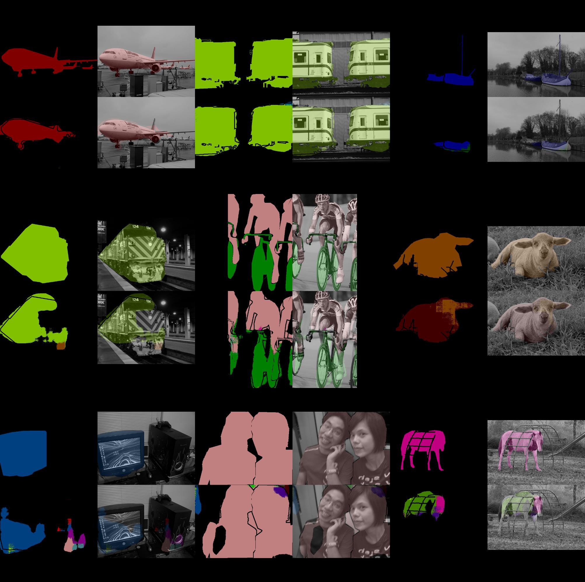

# pytorch-fcn


Fully Convolutional Networks implemented with PyTorch.


## Accuracy

**FCN32s on VOC2012**

|   epoch |   iteration |   valid/loss |   valid/acc |   valid/acc_cls |   valid/mean_iu |   valid/fwavacc |
|--------:|------------:|-------------:|------------:|----------------:|----------------:|----------------:|
|      58 |       84912 |       121321 |    0.868776 |        0.746134 |        0.412695 |        0.821124 |




## Speed

It is ~4 times faster than [FCN implemented with Chainer](https://github.com/wkentaro/fcn).

```bash
% ./speedtest.py --gpu 0 --times 1000
==> Running on GPU: 0 to evaluate 1000 times
==> Testing FCN32s with Chainer
Elapsed time: 208.34 [s / 1000 evals]
Hz: 4.80 [hz]
==> Testing FCN32s with PyTorch
Elapsed time: 56.30 [s / 1000 evals]
Hz: 17.76 [hz]
```
