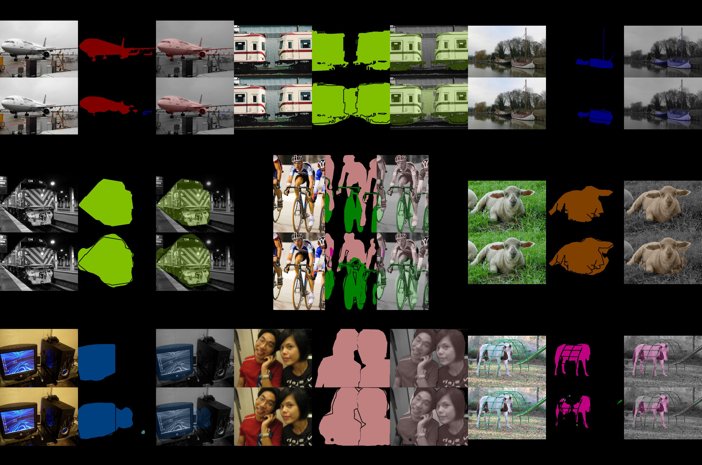

# pytorch-fcn

[](https://pypi.python.org/pypi/torchfcn)
[(https://pypi.org/project/torchfcn)
[](https://travis-ci.org/wkentaro/pytorch-fcn)

PyTorch implementation of [Fully Convolutional Networks](https://github.com/shelhamer/fcn.berkeleyvision.org).


## Requirements

- [pytorch](https://github.com/pytorch/pytorch) >= 0.2.0
- [torchvision](https://github.com/pytorch/vision) >= 0.1.8
- [fcn](https://github.com/wkentaro/fcn) >= 6.1.5
- [Pillow](https://github.com/python-pillow/Pillow)
- [scipy](https://github.com/scipy/scipy)
- [tqdm](https://github.com/tqdm/tqdm)


## Installation

```bash
git clone https://github.com/wkentaro/pytorch-fcn.git
cd pytorch-fcn

conda install pytorch torchvision -c pytorch
pip install .
```


## Training

See [VOC example](examples/voc).


## Accuracy

At `10fdec9`.

| Model | Implementation |   epoch |   iteration | Mean IU |
|:-----:|:--------------:|:-------:|:-----------:|:-------:|
|FCN32s      | [Original](https://github.com/shelhamer/fcn.berkeleyvision.org/tree/master/voc-fcn32s)       | - | -     | **63.63** |
|FCN32s      | Ours                                                                                         |11 | 96000 | 62.84 |
|FCN16s      | [Original](https://github.com/shelhamer/fcn.berkeleyvision.org/tree/master/voc-fcn16s)       | - | -     | **65.01** |
|FCN16s      | Ours                                                                                         |11 | 96000 | 64.91 |
|FCN8s       | [Original](https://github.com/shelhamer/fcn.berkeleyvision.org/tree/master/voc-fcn8s)        | - | -     | **65.51** |
|FCN8s       | Ours                                                                                         | 7 | 60000 | 65.49 |
|FCN8sAtOnce | [Original](https://github.com/shelhamer/fcn.berkeleyvision.org/tree/master/voc-fcn8s-atonce) | - | -     | **65.40** |
|FCN8sAtOnce | Ours                                                                                         |11 | 96000 | 64.74 |


Visualization of validation result of FCN8s.
