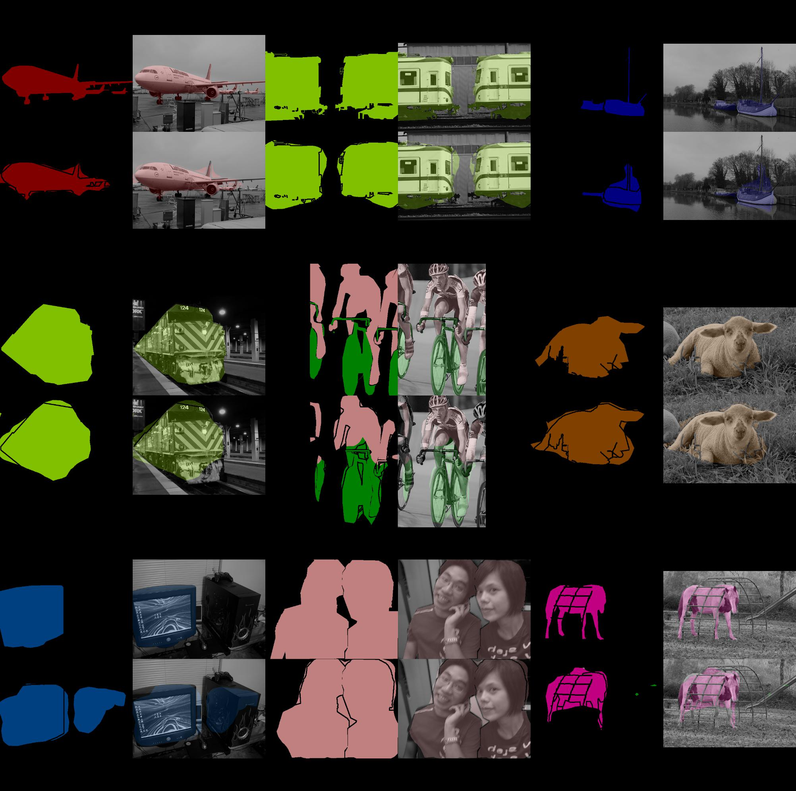

# pytorch-fcn


Fully Convolutional Networks implemented with PyTorch.


## TODO

- Support FCN16s and FCN8s.


## Accuracy

**FCN32s**

- `deconv=False`
- `train=SBDClassSeg(split='train')`
- `val=VOC2011(split='seg11val')`
- `batch_size=1`
- `MomentumSGD(lr=1e-10, momentum=0.99, weight_decay=0.0005)`

|   epoch |   iteration |   valid/loss |   valid/acc |   valid/acc_cls |   valid/mean_iu |   valid/fwavacc |
|--------:|------------:|-------------:|------------:|----------------:|----------------:|----------------:|
|       9 |       76482 | 59656.847812 |    0.897753 |        0.780288 |        0.628707 |        0.844420 |

 


## Speed

PyTorch implementation is faster for static inputs and slower for dynamic ones than [Chainer one](https://github.com/wkentaro/fcn) at test time.  
(In the previous performance, Chainer one was much slower, but it was fixed via [wkentaro/fcn#90](https://github.com/wkentaro/fcn/pull/90).)

```bash
% ./speedtest.py
==> Benchmark: gpu=1, times=1000, dynamic_input=False
==> Testing FCN32s with Chainer
Elapsed time: 48.98 [s / 1000 evals]
Hz: 20.42 [hz]
==> Testing FCN32s with PyTorch
Elapsed time: 45.15 [s / 1000 evals]
Hz: 22.15 [hz]

% ./speedtest.py --dynamic-input
==> Benchmark: gpu=0, times=1000, dynamic_input=True
==> Testing FCN32s with Chainer
Elapsed time: 48.83 [s / 1000 evals]
Hz: 20.48 [hz]
==> Testing FCN32s with PyTorch
Elapsed time: 57.00 [s / 1000 evals]
Hz: 17.55 [hz]
```
